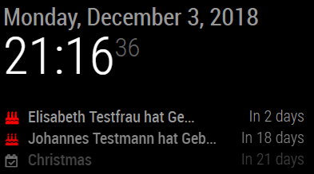

# GoogleBirthdaysProvider

A [MagicMirror²](https://magicmirror.builders/) helper to include the birthdays of your Google Contacts in the default calendar.

[](https://github.com/PalatinCoder/MMM-GoogleBirthdaysProvider/releases)
[](https://travis-ci.com/PalatinCoder/MMM-GoogleBirthdaysProvider)
[](https://github.com/PalatinCoder/MMM-GoogleBirthdaysProvider/blob/master/LICENSE.md)

> ## 🛠 Work in progress
> This module is just a hello world at the moment, so stay tuned until it reaches it's first release

## How it will work

The module reads the birthdays of your Google Contacts via Google's People API and exposes them as an iCal Feed through an internal URL, so you can include it in the default calendar.



## Installation

1. In your `modules/` directory, `git clone https://github.com/PalatinCoder/MMM-GoogleBirthdaysProvider.git`
2. `cd` in the new `MMM-GoogleBirthdaysProvider` directory
3. `npm install --production` (note the production flag, so you don't get all the dev dependencies - you don't need them if you just want to use the module)
4. Add the module to your `config.js`:
   ```
   {
       module: "MMM-GoogleBirthdaysProvider",
       config: {}
   },
   ```
   Note: Don't give the module a position, as it doesn't render any DOM at all

5. Add `http://localhost:8080/mmm-googlebirthdaysprovider` to your calendar URLs, something like this:
   ```
   (...)
		{
			module: "calendar",
			position: "top_left",
			config: {
				calendars: [
					{
						url: 'http://localhost:8080/mmm-googlebirthdaysprovider',
						symbol: 'birthday-cake',
						color: '#f00'
					}
				]
			}
		}
   (...)
   ```

